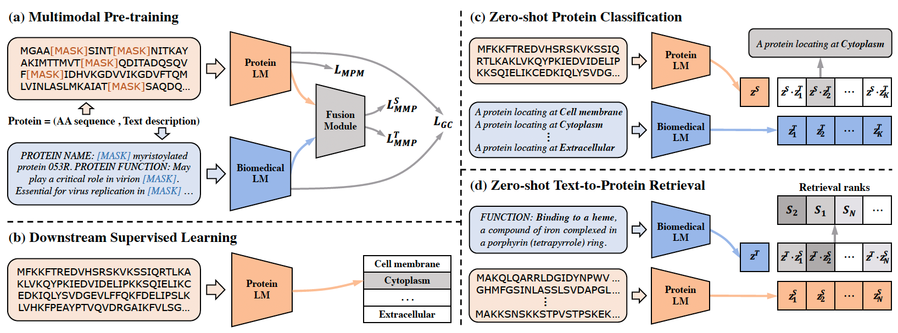

# ProtST: Multi-Modality Learning of Protein Sequences and Biomedical Texts

ProtST is an advanced pretraining framework for protein sequence understanding and prediction, as introduced in our [ICML2023 oral paper](https://arxiv.org/abs/2301.12040). It is designed to enhance protein sequence pre-training and understanding by integrating protein functions and other important properties through biomedical texts.

The effectiveness and superiority of ProtST-induced PLMs over previous ones are demonstrated on diverse representation learning downstream tasks and zero-shot predictions. It also enables functional protein retrieval from large-scale databases even without any function annotation, as illustrated below.



# Installation #

You may install the dependencies of TorchProtein and ProtST as below. 
Generally, they work with Python 3.7/3.8 and PyTorch version >= 1.8.0.

```bash
conda create -n protein python=3.9
conda activate protein

conda install pytorch==2.0.0 pytorch-cuda=11.7 -c pytorch -c nvidia
conda install torchdrug pytorch-sparse pytorch-scatter pytorch-cluster -c pytorch -c pyg -c milagraph

conda install scikit-learn pandas decorator ipython networkx tqdm matplotlib -y
conda install fair-esm transformers easydict pyyaml lmdb -c conda-forge
```

# Pre-trained Model Zoo

|      Model      |                      Config                      |                                                                          Ckpt                                                                           |
|:---------------:|:------------------------------------------------:|:-------------------------------------------------------------------------------------------------------------------------------------------------------:|
|  ProtST-ESM-1b  |   [config](config/pretrain/pretrain_esm.yaml)    |                                     [ckpt](https://protsl.s3.us-east-2.amazonaws.com/checkpoints/protst_esm1b.pth)                                      |
|  ProtST-ESM-2   |   [config](config/pretrain/pretrain_esm.yaml)    |                                                                        [ckpt](https://protsl.s3.us-east-2.amazonaws.com/checkpoints/protst_esm2.pth)    |                                                                     |
| ProtST-ProtBert | [config](config/pretrain/pretrain_protbert.yaml) |                                    [ckpt](https://protsl.s3.us-east-2.amazonaws.com/checkpoints/protst_protbert.pth)                                    |

# Usage

To reproduce all the experiments in ProtST, we provide all the necessary configuration files at `config/.../*.yaml`, which are categorized by the dataset, model architecture, and hyperparameters. When running experiments, we specify the configuration file with an argument `--config` and all the required arguments marked by `{{ }}` in that configuration file.

Note that all the datasets will be automatically downloaded in the code. But if you are using clusters without Internet connection, please run `python ./script/prepare_all_datasets.py` to cache datasets in advance.

## Pre-training

By default, we pretrain 3 different PLM backbones (ESM-1b, ESM2 and ProtBert) using 4 V100 GPUs with the following command. Note that we have the choice of using two versions of text encoders: PebMedBert trained with only abstracts `PebMedBert-abs` and PebMedBert trained with full papers `PebMedBert-full`.

```
alias python4proc='python -m torch.distributed.launch --nproc_per_node=4'

# pretrain ESM-1b
python4proc script/run_pretrain.py --config ./config/pretrain/pretrain_esm.yaml --protein_model ESM-1b --text_model PubMedBERT-abs

# pretrain ESM-2
python4proc script/run_pretrain.py --config ./config/pretrain/pretrain_esm.yaml --protein_model ESM-2-650M --text_model PubMedBERT-abs

# pretrain ProtBert
python4proc script/run_pretrain.py --config ./config/pretrain/pretrain_protbert.yaml --text_model PubMedBERT-abs
```

## Downstream Tasks: Representation Learning

For representation learning, we verify our pre-trained multimodal PLMs on 11 standard benchmarks for protein localization prediction, fitness landscape prediction and protein function annotation, under both fix-encoder learning and full-model tuning settings.

We label the pretrained checkpoints as `PRETRAIN_CHECKPOINT`. For different PLM backbone, the corresponding configuration files are in `./config/downstream_task/.../*.yaml`. We give a demonstration for ProtST-enhanced ESM-1b. 

### Protein Localization Prediction

For binary localization prediction, you can run as below to perform fix-encoder learning and full-model tuning, respectively:

```
# fix-encoder learning
python4proc ./script/run_downstream.py --config ./config/downstream_task/PretrainESM/localization_fix.yaml --checkpoint $PRETRAIN_CHECKPOINT --dataset BinaryLocalization --num_class 2

# full-model tuning
python4proc ./script/run_downstream.py --config ./config/downstream_task/PretrainESM/localization_tune.yaml --checkpoint $PRETRAIN_CHECKPOINT --dataset BinaryLocalization --num_class 2
```

**Note that**, subcellular localization can be performed in the similar way (please see `./config` for details).

### Fitness Landscape Prediction

For Beta-Lactamase fitness prediction, you can run as below to perform fix-encoder learning and full-model tuning, respectively:

```
# fix-encoder learning
python4proc ./script/run_downstream.py --config ./config/downstream_task/PretrainESM/fitness_fix.yaml --checkpoint $PRETRAIN_CHECKPOINT --dataset BetaLactamase --batch_size 32

# full-model tuning
python4proc ./script/run_downstream.py --config ./config/downstream_task/PretrainESM/fitness_tune.yaml --checkpoint $PRETRAIN_CHECKPOINT --dataset BetaLactamase --batch_size 6
```

**Note that**, Fluorescence, Stability, AAV and Thermostability prediction can be performed in the similar way (please see `./config` for details).

### Protein Function Annotation

For Enzyme Commission (EC) number prediction, you can run as below to perform full-model tuning:

```
python4proc ./script/run_downstream.py --config ./config/downstream_task/PretrainESM/annotation_tune.yaml --checkpoint $PRETRAIN_CHECKPOINT --dataset td_datasets.EnzymeCommission --branch null
```

**Note that**, the Gene Ontology (GO) term prediction at Molecular Function (MF), Biological Process (BP) and Cellular Component (CC) branches can be performed in the similar way (please see `./config` for details).

## Downstream Tasks: Zero-shot Protein Classification

### Zero-shot Predictors

ProtST supports zero-shot protein classification, where it does not require any labeled protein. This is achieved by comparing representation similarities between a query protein and all labels, thanks to the aligned representation space of protein sequences and label descriptions in ProtST. 

We demonstrate on zero-shot subcellular localization prediction and zero-shot reaction classification with ProtST-enhanced ESM-1b. We have also explored different prompt templates and description fields as listed in `./data/zero_shot_classification/`.

```
# Subcellular Localization Prediction

python ./script/run_zero_shot.py --config ./config/zero_shot/PretrainESM/zero_shot.yaml --checkpoint $PRETRAIN_CHECKPOINT --prompt_label ./data/zero_shot_classification/subloc_name.tsv --dataset SubcellularLocalization --field "['name']"

# Reaction Classification

python ./script/run_zero_shot.py --config ./config/zero_shot/PretrainESM/zero_shot.yaml --checkpoint $PRETRAIN_CHECKPOINT --prompt_label ./data/zero_shot_classification/reaction_name.tsv --dataset Reaction --field "['name']"
```

### Few-shot and Non-parametric Baselines

ProtST-induced zero-shot classifiers have better data efficiency against various few-shot and non-parametric classifiers. You can run these baselines as below:

```
# few-shot classifiers

## Subcellular Localization Prediction

python ./script/run_few_shot.py --config ./config/few_shot/PretrainESM/few_shot.yaml --dataset SubcellularLocalization --num_class 10  --checkpoint $PRETRAIN_CHECKPOINT 

## Reaction Classification

python ./script/run_few_shot.py --config ./config/few_shot/PretrainESM/few_shot.yaml --dataset Reaction --num_class 384  --checkpoint $PRETRAIN_CHECKPOINT 

# non-parametric few-shot classifiers

## Subcellular Localization Prediction

python ./script/run_few_shot_nonparam.py --config ./config/few_shot/PretrainESM/few_shot.yaml --dataset SubcellularLocalization --num_class 10  --checkpoint $PRETRAIN_CHECKPOINT

## Reaction Classification

python ./script/run_few_shot_nonparam.py --config ./config/few_shot/PretrainESM/few_shot.yaml --dataset Reaction --num_class 384  --checkpoint $PRETRAIN_CHECKPOINT 
```

### Predictor Ensemble

We also show that ProtST-based zero-shot predictor can enhance the performance of supervised learning models via ensemble. We use the following scripts to do ensembles, where `SUPERVISED_CHECKPOINT` refers to the checkpoints obtained by supervised learning on downstream tasks.

```
## Subcellular Localization Prediction

python ./script/run_supervised_with_zero.py -sc ./config/downstream_task/PretrainESM/localization_fix.yaml -zc ./config/zero_shot/zero_shot.yaml --dataset SubcellularLocalization --num_class 10 --prompt_label ./data/zero_shot_classification/subloc_name.tsv --field "['name']" --checkpoint $PRETRAIN_CHECKPOINT --supervised_checkpoint $SUPERVISED_CHECKPOINT

## Reaction Classification

python ./script/run_supervised_with_zero.py -sc ./config/downstream_task/PretrainESM/reaction_tune.yaml -zc ./config/zero_shot/zero_shot.yaml --dataset Reaction --num_class 384 --prompt_label ./data/zero_shot_classification/reaction_name.tsv --field "['name']" --checkpoint $PRETRAIN_CHECKPOINT --supervised_checkpoint $SUPERVISED_CHECKPOINT
```

## Downstream Tasks: Text to Protein Retrieval

We illustrate the capability of ProtST-ESM-1b on retrieving functional proteins as below, where no function annotation is required:

```
python ./script/run_t2p_retrieval.py --config ./config/t2p_retrieval/go_mf.yaml --checkpoint $PRETRAIN_CHECKPOINT
```

# Citation

If you find this project helpful, please cite our paper:

```
@article{xu2023protst,
  title={ProtST: Multi-Modality Learning of Protein Sequences and Biomedical Texts},
  author={Xu, Minghao and Yuan, Xinyu and Miret, Santiago and Tang, Jian},
  journal={arXiv preprint arXiv:2301.12040},
  year={2023}
}
```

# Contact

For any questions or issues, open an issue or contact 
Minghao Xu (minghao.xu@mila.quebec) and Xinyu Yuan (xinyu.yuan@mila.quebec).
